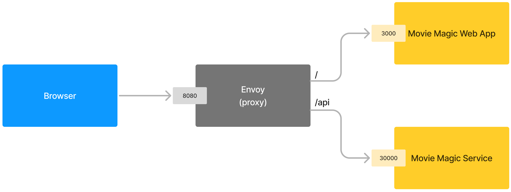

# Movie Magic gRPC Client

A React app that connects to
[Movie Magic gRPC services](https://github.com/nareshbhatia/movie-magic-services-go)
to show a list of movies.

It uses the gRPC-web protocol to access the Movie Magic gRPC API.
[Buf CLI](https://buf.build/docs) and
[Connect for Web](https://connectrpc.com/docs/web/getting-started) are used to
generate Typescript code to access this API.

Here's the overall architecture:



## Prerequisites for development

1. Install [Node Version Manager](https://github.com/nvm-sh/nvm) (nvm) - it
   allows using different versions of node via the command line.
2. Install
   [Envoy proxy](https://www.envoyproxy.io/docs/envoy/latest/start/install) - it
   is needed to make the Movie Magic gRPC service available to gRPC-web.
3. Start
   [Movie Magic Services in Go](https://github.com/nareshbhatia/movie-magic-services-go)
   and make sure that it is running correctly.

   - `go run ./server/main.go` (starts the server at port 30000)
   - `go run ./client/main.go` (should print a list of movies)

4. Start Envoy (in this directory): `envoy -c envoy.yaml`. This exposes:
   - the Movie Magic client at http://localhost:8080
   - the Movie Magic gRPC API at http://localhost:8080/api

## Development Build

```shell
nvm use        # use the required version of node
npm ci         # install dependencies
npm run build  # build all packages
npm run dev    # run apps
```

Open a browser windows at http://localhost:8080 to see the app.

## Verify Envoy Setup

** Note: Currently this does not work **

You can verify your Envoy setup as follows:

1. Go to the local copy of the server repo
   [Movie Magic gRPC services](https://github.com/nareshbhatia/movie-magic-services-go)
2. Run the following command.

```shell
buf curl --schema . --protocol grpcweb --http2-prior-knowledge http://localhost:8080/api/movie.v1.MovieService/ListMovies
```

It should print a list of movies in JSON format.
